# CLIPN for Zero-Shot OOD Detection: Teaching CLIP to Say No

## Abstract

本文提出了一种新颖的方法，即让CLIP 说“不”（CLIPN），它**增强了 CLIP 中说“不”的逻辑**。

主要动机是让 CLIP 具备使用**肯定语义提示**和**否定语义提示**区分 OOD 和 ID 样本的能力。具体来说，我们设计了一种新颖的可学习的**“不”提示**和一个**“不”文本编码器**来捕获图像中的否定语义。随后，我们引入了两个损失函数：图像文本二元**相反损失**和文本语义**相反损失**，我们用它们来教 CLIPN 将图像与**“否”提示**关联起来，从而使其能够识别未知样本。

此外，我们提出了两种**无阈值推理算法**，通过利用“否”提示和文本编码器的否定语义来执行 OOD 检测。 

OOD 检测任务的 9 个基准数据集（3 个 ID 数据集和 6 个 OOD 数据集）上的实验结果表明，基于 ViT-B-16 的 CLIPN 在 AUROC 方面优于 7 个常用算法至少 2.34% 和 11.64% FPR95 用于 ImageNet-1K 上的零样本 OOD 检测。我们的 CLIPN 可以为在下游 OOD 任务中有效利用 CLIP 奠定坚实的基础。

## Introduction

背景工作这里就提一下文章说到MCM的不足：该方法仍然忽视了处理难以区分 OOD 样本的挑战，并且性能有限。与 ZOC和 MCM不同，本文尝试利用 CLIP 中的**开放世界知识**直接识别一些难以区分的 OOD 样本，即使它们的 ID 度很高（很像ID的样本）。

如图所示的玩具示例。如图2(a)所示，给定狗图像和猫图像，我们设计四组提示。

两组包含类别提示：**with/of/.../having** the photos of the dog or cat，

另外两组则使用**“否”提示**：a photo **without/not of/.../not having** the dog or cat.

我们在 CLIP 上做了一个实验，用四个提示来匹配图像。不幸的是，结果表明CLIP未能准确匹配图像，这意味着它**缺乏“不”逻辑**；

如图 2 (b) 中的玩具可视化和图 6 中的定性可视化所示。

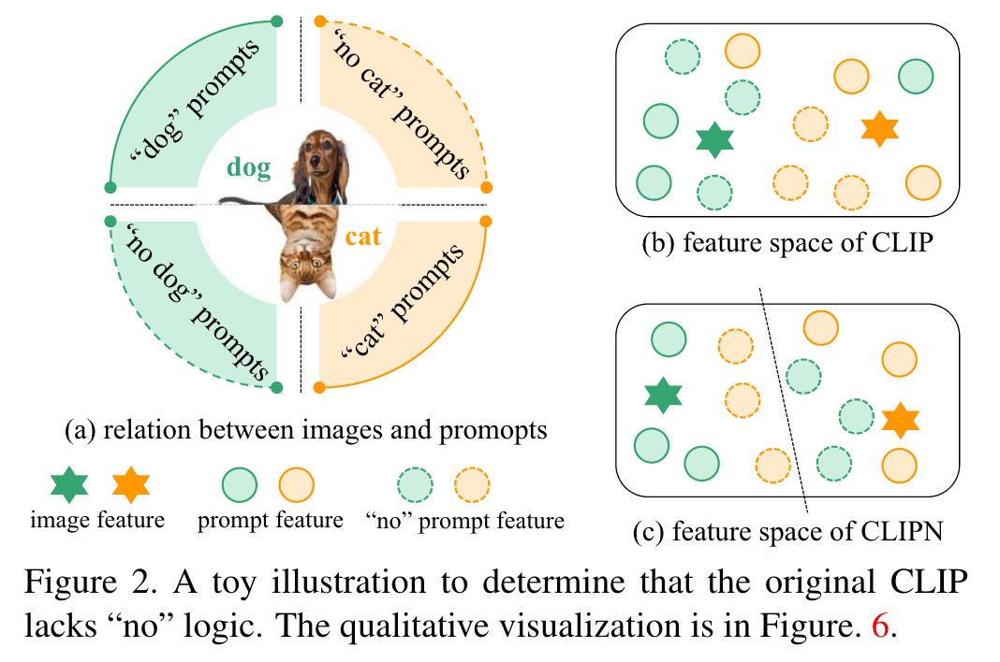

因此，为了在 CLIP 中赋予**“不”逻辑**，本文提出了一种新的 CLIP 架构，称为 CLIP 说“不”(CLIPN)。从三个方面对CLIP在OOD检测方面进行了升级。

1. **架构。** 在CLIP 中添加了**新的“否”提示和“否”文本编码器**。我们新颖的可学习“不”提示在提示中**集成了否定语义**，补充了原始 CLIP 的提示。此外，我们的“不”文本编码器**捕获图像相应的否定语义**，使 CLIP 说“不”成为可能。 

2. **训练损失。**我们进一步提出两个损失函数。第一个是**图像-文本二元相反损失**，它使**图像特征与正确的“否”提示特征相匹配**。换句话说，它可以**教会 CLIP 何时说“不”**。第二个是**文本语义相反的损失**，这使得**标准提示和“否”提示嵌入得彼此相距甚远**。换句话说，它可以**教会 CLIP 理解“否”提示的含义**。

3. **无阈值推理算法。**经过 CLIPN 的训练后，我们设计了两种无阈值算法：competing-to-win 和 agreeingto-differ。competing-to-win的目标是从标准的和“否”文本编码器中选择**最置信的概率**作为最终预测。同时，通过考虑标准和“无”文本编码器的预测，agreeingto-differ会**为 OOD 类别生成额外的概率**。

   9 个基准数据集（3 个 ID 数据集和 6 个 OOD 数据集）的实验结果表明，我们的 CLIPN 优于现有方法。

## Methodology

### CLIP-based OOD detection

简要回顾一下如何执行零样本 OOD 检测：

1. CLIP的图像编码器用于提取图像特征。

2. 尽管 CLIP 中没有分类器，但我们可以使用 ID 类的名称来构建文本输入（例如，“a photo of the dog”）。从文本编码器获取文本特征作为**分类权重**，**其功能与分类器发挥相同的作用**。

3. 以最大softmax概率（MSP）算法为例，我们可以根据图像特征和类别权重计算MSP。如果 MSP 小于预定义的阈值，则图像将被视为 OOD，反之亦然。

### Overview

- **架构。**如图 3 所示，CLIPN 建立在预训练的 CLIP 之上，由三个模块组成：

  1. **图像编码器：$\phi$。** CLIPN的图像编码器保持与预训练CLIP的图像编码器**相同的结构和参数**。在本文中，ViT-B [6]和ViT-L [6]分别被部署来实例化φ，φ的参数冻结。
  2. **文本编码器：$\psi$。** CLIPN的文本编码器ψ与预训练CLIP的文本编码器**保持相同的结构和参数**。 ψ 的输入也保持不变，即描述一个图像的标准文本（例如，“a photo with/of/...”）。
  3. **“否”文本编码器：${\psi}^{no}$。**它**由预训练 CLIP 的文本编码器初始化**。但与$\psi$不同的是，$\psi$ 为不可学习的。 ${\psi}^{no}$的输入是一个负文本，用相反的语义描述一幅图像。（换句话说，**$\psi$ 不用训练。 ${\psi}^{no}$需要训练**）

  此外，本文从 OpenCLIP [16] 访问预先训练的 CLIP。在本文中，我们使用两种预训练模型，包括**基于 ViT-B 的 CLIP** 和使用 **Laion-2B 数据集预训练的 ViT-L**

  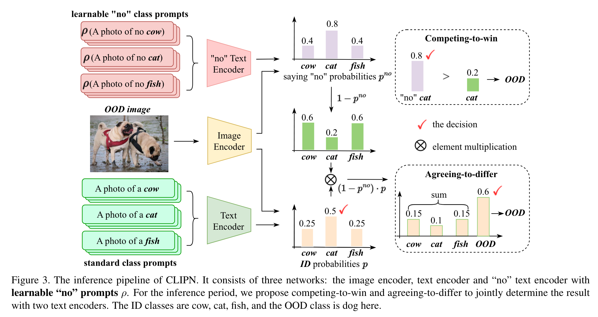

- **预训练 CLIPN。**

  1. 设计了一种新颖的“no”提示策略，将具有否定逻辑的文本描述引入 ${\psi}^{no}$。
  2. 基于上述相反语义的思想，提出**了图像-文本二元相反损失和文本语义相反损失**，让 CLIPN 学习**何时**以及**如何**将图像与两种类型的文本对齐。

- **推理。**

  在推理阶段进一步提出了两种新颖的**无阈值算法**来**确定输入图像是否 OOD**。

  1. 竞争获胜算法：首先使用标准文本和输入图像来预测属于 ID 类别的概率。然后利用**概率最高的类别的“否”文本**来确定ID预测是否正确。
  2. 接受差异算法：我们使用“no”文本来**缩小 ID 概率**并**生成 OOD 类的新概率**。如果 **OOD 概率最高**，则输入图像将被判断为 OOD。

### Prompt Design

在原始的CLIP中，图像是按照正逻辑来描述的，即文本内容与图像内容在语义上是一致的。

我们试图补充一种**否定逻辑**，即文本内容与图像内容在语义上是**否定的**。为此，我们定义了一系列“不”提示来补充原文。表示一幅图像 $x$ 的文本为 $t$，“否”提示池定义为 ：

${pool}_{no}(t)$ = {"a photo without {$t$}"", "a photo not appearing {$t$}"", ..., "a photo not containing {$t$}"}

其中有L个人工制作的“否”提示，该提示池是在“Better vision-language models with feature adapters”这篇文章的基础上构建的，并用**否定关键字**进行了修改。

在训练过程中，给定输入文本 $t$，我们从${pool}_{no}$中随机选择一个“no”提示来生成具有“no”逻辑的文本 $t_{no}$。接下来，使用token嵌入层 $ρ$ 将“否”文本嵌入为一组token特征向量 $ρ(t_{no})$，这是“否”文本编码器的输入token。

此外，受"Conditional prompt learning for vision-language models"的启发，设计了可学习的“no”提示。我们替换掉否定关键词（如，"a photo without "）为一些**可学习的参数 σ** 来表示否定语义的token特征，并与特征空间中 t 的token特征相结合。

### Training Loss Design

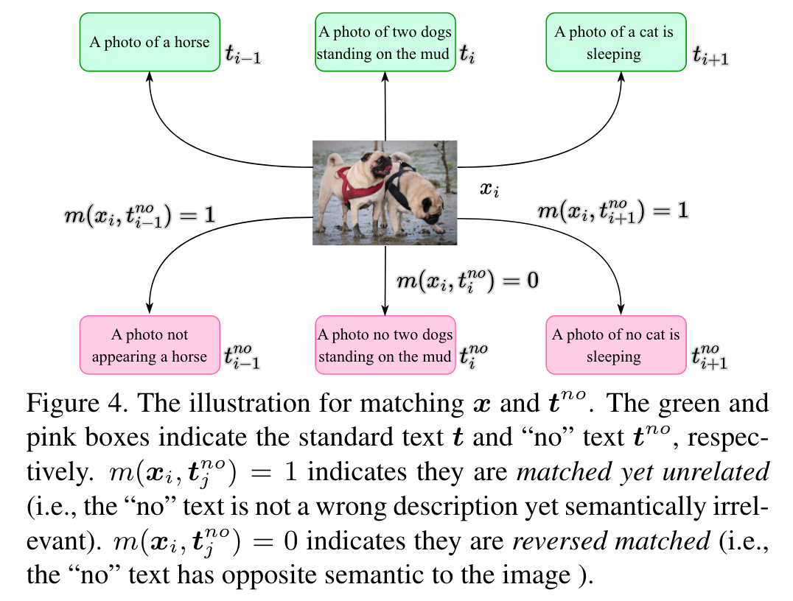

**Mini-Batch：** $\mathcal{B}=\left\{\left(\boldsymbol{x}_{i}, \boldsymbol{t}_{i}, \boldsymbol{t}_{i}^{n o}\right)\right\}_{i=1}^{N} \in \mathbb{D}_{c l i p}$

**编码：**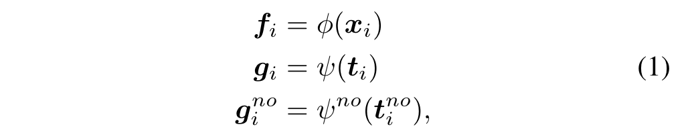

**两个损失函数：**

- **图像-文本二元相反损失（ITBO）**

  该损失函数帮助模型将图像特征与正确的“否”文本特征进行匹配。

  具体来说，我们定义图像和“否”文本之间的两种关系：（1）**匹配但不相关**（即“否”文本不是错误的描述，但在语义上与图像无关）； (2) 反向匹配（即“no”文本与图像具有相反的语义），如图 4 所示。因此，第 i 个图像和第 j 个“否”文本之间的匹配度 $m({\boldsymbol{x}}_i,{\boldsymbol{t}}_j^{no})$定义如下：

  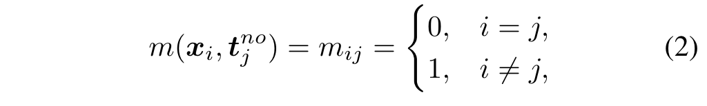

  =0为反向匹配，=1位匹配但不相关。CLIPN的目标是在特征空间让图像与“no”文本匹配：

  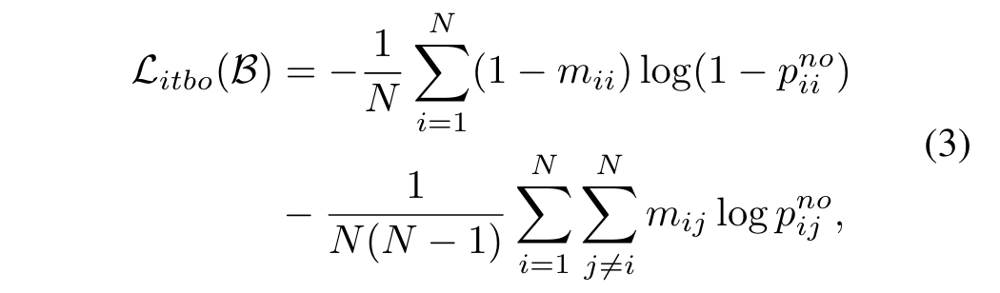

  $p_{ij}^{no}$表示第 i 个图像和第 j 个“no”文本之间的匹配概率：

  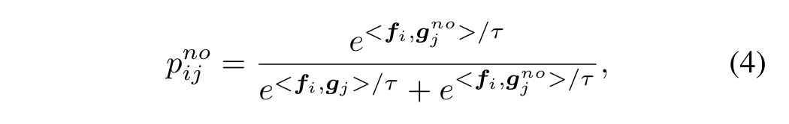

  <,>表示两个向量的内积，$τ$是可学习的温度系数。

- **文本语义相反损失（TSO）**

  “no”提示使$t_i$和$t_i^{no}$在语义上相反，因此，特征空间的$g_i$和$g_i^{no}$也应该彼此远离。因此， $\mathcal{L}_{tso}$ 定义为：

  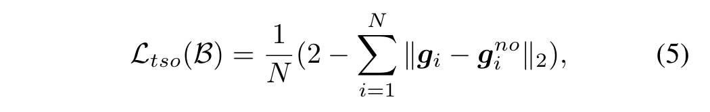

  其中 $∥∥_2$ 是 L2 距离函数。当所有$g_i$和$g_i^{no}$对嵌入到特征空间中的相反方向时，$\mathcal{L}_{tso}$ 将减小到 0。

一个mini-batch的总损失通过将上述**两个损失值相加**来计算：$\mathcal{L}_{B}=\mathcal{L}_{itbo}+\mathcal{L}_{tso}$ 。

### Inference algorithm of CLIPN

CLIPN 部署到测试数据集执行零样本 OOD 检测任务时，只需要所有的类名。对于包含 $C$ 个ID 类别的任务，如图 3 所示，每个类的名称被输入到标准文本和“no”文本中，然后输入到$\psi$ 和 ${\psi}^{no}$中。实际上，我们在Sec.3.3节中介绍了提示池，将所有文本特征加起来，那么ID类概率可以表示为：

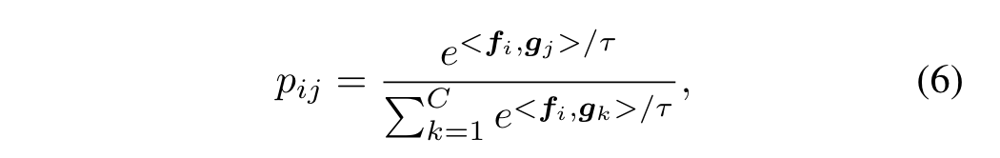

$p_{ij}$表示输入图像$x_i$属于第 j 类的预测概率。$x_i$与第j个“no”文本匹配的概率通过公式4计算。接下来提出两种新颖的无阈值算法来确定$x_i$是否为 OOD。

- **竞争获胜算法（CTW）。**受MSP启发，找到具有**最大 ID 概率**的类。然后我们比较$p^{no}$和$p^{yes}$（即$1 − p^{no}$）的值以确定$x_i$是否为 OOD（或 ID），表示如下：

​	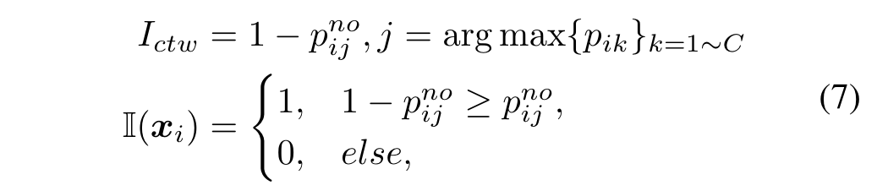

- **接受差异算法（ATD）。**尽管如此，上述策略还是有些激进。**在某些难以区分的情况下会失败**（例如，最大 ID 概率并不明显高于其他概率，即OOD和某几个ID类都很像）。为了使决策更加灵活，我们提出了另一种算法，称为接受差异（ATD），以考虑所有 ID 概率和 $p^{no}$。它可以将 C 类概率重新表示为 (C + 1) 类概率，**创建一个未知类**，其概率定义为：

​	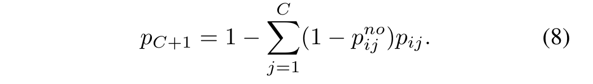

​		OOD样本通过以下形式检测到：如果未知类的概率 $p_{C+1}$ 大于所有 ID 概率，则输入图像将被检测为 OOD。否则判定为ID。

​		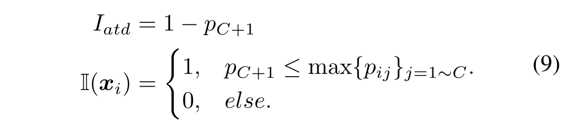

## Limitations		

我们的方法的一个局限性是缺乏对其扩展到 **OOD 分割或检测任务**的清晰演示。

另一个局限是其在**医学和卫星图像**等专门数据集中的 OOD 分类有效性的不确定性。

这主要是因为我们的模型基于 CLIP，并且**其在专业数据集中的有效性尚未得到充分探索**。