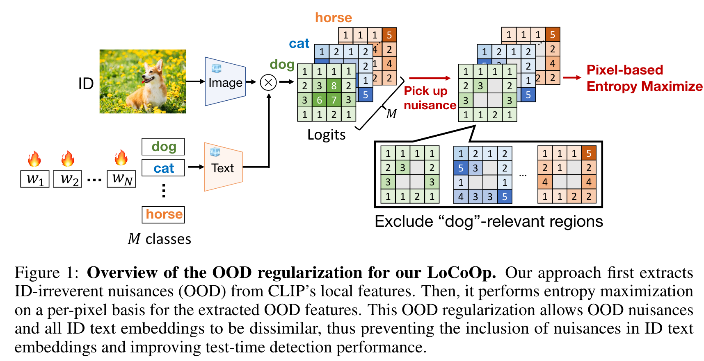
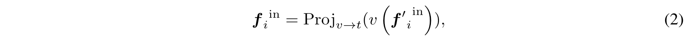
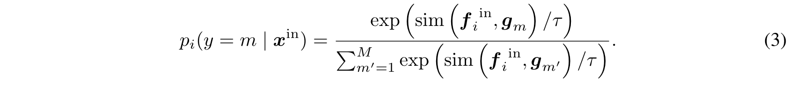
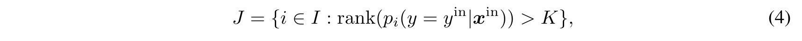
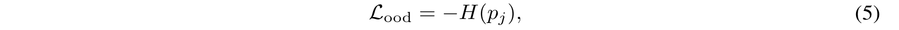
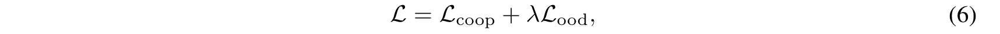

# LoCoOp: Few-Shot Out-of-Distribution Detection via Prompt Learning

## Abstract

虽然 CoOp 等提示学习方法在小样本 ID 分类中显示出有效性和效率，但由于**文本嵌入中可能存在与 ID 无关的信息**，它们在 OOD 检测中仍然面临局限性。为了解决这个问题，我们引入了一种**局部正则化上下文优化**（LoCoOp）的新方法，该方法执行 **OOD 正则化**，在训练期间利用 CLIP 局部特征的部分作为 OOD 特征。 CLIP的局部特征有很多**与ID无关的干扰（例如背景）**，通过学习将它们从ID类文本嵌入中推开，我们可以**消除ID类文本嵌入中的干扰**并增强ID和OOD之间的分离。

## Introduction

小样本训练 CLIP 的最常见方法是以CoOp 为代表的提示学习，它训练提示的上下文单词，同时保持整个预训练参数固定。但CoOp 对于 OOD 检测仍然效果不佳。虽然 CoOp 旨在使给定的 ID 图像与其相应的类文本嵌入更紧密地结合在一起，但它也可能使文本嵌入更接近 ID 图像中的**背景**或与 ID **无关的对象**。因此，文本嵌入可能包含与 ID 图像不相关的信息，导致 OOD 图像的置信度分数不正确。

本文提出的LoCoOp 将ID中的背景/无关的对象称为OOD，并学习将它们从 **ID 类文本嵌入中剔除**，防止模型为 OOD 特征生成高 ID 置信度分数。为了实现这一点，LoCoOp 首先使用每个局部区域的**分割分类预测结果**来**识别 ID 无关区域**。接下来，它对提取的区域执行**分类概率的熵最大化**，这确保 **ID 无关的区域中的特征与任何 ID 文本嵌入都不同。**LoCoOp 有两个显着的优点：

1. 以最小的成本执行OOD正则化。 OOD 正则化的标准方法是 OOD 暴露，利用外部 OOD 样本进行训练。然而，收集大量 OOD 图像可能会非常麻烦。此外，由于 OOD 图像的数量和训练时间成正比，因此计算成本可能很高。
2. LoCoOp 仅使用 CLIP 的本地功能作为 OOD。因此，即使每个 ID 图像使用 100 个 OOD 特征，与没有 OOD 正则化的baseline（即 CoOp）相比，训练时间也仅长约 1.4 倍，GPU 内存消耗也仅高约 1.1 倍。
3. LoCoOp 与 GL-MCM [33] 高度兼容，GL-MCM 是一种测试时 OOD 检测方法，使用全局和局部特征分离 ID 和 OOD。由于LoCoOp学习局部OOD特征，因此它可以**准确识别给定的局部区域是ID还是OOD**。这使得 LoCoOp 能够利用 GL-MCM 提高 OOD 检测性能，显着优于其他方法。

## Method

LoCoOp概述如图 1 所示，主要由两个部分组成：

1. 从 CLIP 局部特征中提取与 ID 无关的区域，
2. 用提取的区域进行 OOD 正则化训练。

- **Preliminary：**为了获得 CLIP 的局部特征，首先将每个区域 i 的视觉特征从特征图中投影到文本空间。这些预测是 CLIP 固有的，**不需要训练**。该局部特征的视觉和文本特征高度对齐。

- **提取ID无关区域：**我们需要从一组所有区域索引 I = {0, 1, 2, ..., H × W − 1} 中选择与 ID 无关的区域的区域索引。与分割任务类似，我们可以通过计算每个区域i的图像特征fi**与ID类的文本特征之间的相似度**来获得训练期间每个区域i的分类预测概率。

  

  当区域 i 对应于 ID 对象的一部分时，真值类别$y^{in}$应该属于 **top-K 预测之一**。相反，如果区域 i 与 ID 无关，例如背景，则$y^{in}$不应该出现在 top-K 预测中，因为区域 i 和真实标签$y^{in}$之间缺乏语义关系。基于这一观察，我们将前 K 个预测类别中不包括其真实类别的区域识别为 ID 无关区域 J。公式如下：

  

  该方法可能看起来是一种**参数相关**的方法，因为它取决于超参数 K。但是，我们认为最佳 K 并不难搜索。这是因为，在现实世界中应用 OOD 检测时，假设用户了解 ID 数据是什么。例如，当ID为ImageNet-1K时，用户预先知道细粒度类的数量或类之间的语义关系。使用先验知识，例如细粒度类的数量，有助于确定 K 的值（直到 top-K，预测可能是错误的）。

- **OOD正则化：利用 $J$ 执行 OOD 正则化，从文本特征中删除不必要的信息。每个 OOD 区域 j ∈ J 的 OOD 特征应与任何 ID 文本嵌入不同。因此，我们使用**熵最大化**进行正则化，用于在训练期间检测未知样本。熵最大化使得 $p_j(y|x^{in})$ 的熵更大，并使 OOD 图像特征与任何 ID 文本嵌入不同。此正则化的损失函数如下：

  

  最终的损失为CoOp的损失加上该损失：

  