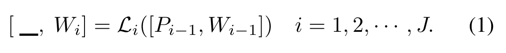
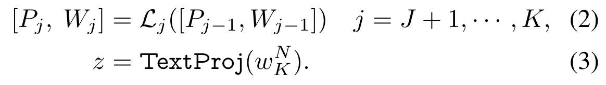
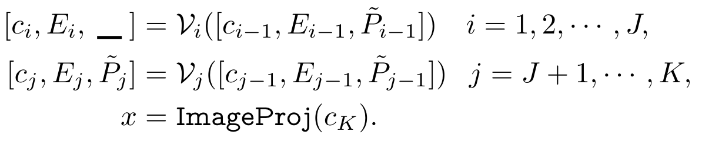
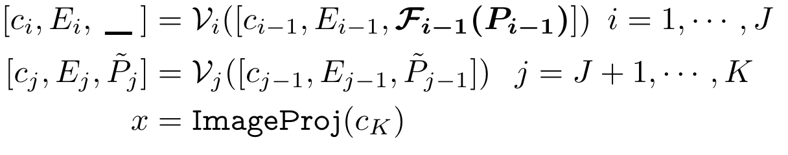

# MaPLe: Multi-modal Prompt Learning

## Abstract

作者注意到，在 CLIP 的单一分支（语言分支或视觉分支）中使用prompt来调整表征是次优的，因为单一分支在下游任务中动态调整两个表征空间的*灵活性*欠缺。

MaPLe促进了视觉和语言表征的对齐。这种设计促进了视觉-语言提示之间的**强耦合**，以确保二者相互协同，并遏止了独立学习的单模态解决方案。此外，我们在不同的早期阶段分别学习不同的prompt，以逐步建立**阶段性特征关系模型**，从而实现丰富的情境学习。

实验：在三个具有代表性的任务：对新类别、新目标数据集和未见领域转换的泛化。

​			与CoCoOp相比，新类上高了3.45%，在11个不同的图像识别数据集上的平均值高了2.72%。

## Introduction

**Motivation：**motivation源于 CLIP 的多模态的本质，即文本编码器和图像编码器共存，两者都有助于正确调整 V-L 模态。任何prompt learning技术都应完全适应模型，因此，**仅针对 CLIP 中的文本编码器学习prompt并不适合图像编码器所需的适应性建模**。

**Contribution：**

1. 第一个提出在 CLIP 中进行**多模态prompt学习**，以便更好地调整其视觉语言表征。
2. 为了将在文本和图像编码器中学习到的提示联系起来，提出了一种**耦合函数**，以明确地将视觉提示作为其语言对应物的条件。它充当了**两种模态之间的桥梁**，允许梯度相互传播，以促进协同作用。
3. 我们的多模态prompt学习是通过视觉和语言分支中的多个transformer块学习的，以逐步学习两种模态的协同行为。这种深度prompt策略允许对上下文关系进行独立建模，从而为对齐视觉语言表征提供了更多的灵活性。

## Method

**概述：**

1. 在语言分支中添加了可学习的的上下文标记(token)，通过一个耦合函数将视觉prompt作为语言prompt的条件，以建立二者之间的交互关系。

2. 为了学习分层的上下文表征，在两个分支中都引入了**深度提示（deep prompting）**，通过不同的transformer块分别进行可学习的上下文提示。
3. 在 fine-tuning 过程中，只有上下文prompt及其耦合函数被学习，而模型的其他部分则被冻结。

**具体方案：**

1. 方法的必要性：

   

   除了多模态提示外，我们还发现必须在更深的transformer层中学习提示，以逐步建立阶段性特征表征模型。

2. 深度文本/视觉提示学习

   在语言编码器 ($L_i$) 的每个transformer块中进一步引入新的可学习词块(token)，直至特定的深度 J。

   

   [.,.]表示连接操作。在第J个transformer层之后，后续的层处理之前层的提示，最终得到文本表征z。

   

   J=1时，MaPLe退化为CoOp。

   深度视觉提示学习与上述类似：

   

3. 视觉-文本提示耦合

   通过在两种模态之间**共享提示**，将 CLIP 的视觉和语言分支结合起来。如公式 1-3 所示，与深度语言提示类似，语言提示tokens被引入语言分支，直到第 J 个transformer块。为了确保 V-L 提示之间的**相互协同**，视觉提示̃ P 是通过视觉到语言的**投影**（我们称之为 V-L 耦合函数 $F(-)$）将语言提示 P 投影得到的，这样$\tilde{P}_k=F_k(P_K)$。耦合函数以**线性层**的形式实现，将$d_l$维输入映射为$d_v$。这将成为两种模态之间的桥梁，从而促进梯度的相互传播。

   

   与独立的 V-L 提示不同，对 P 的 ̃ P 进行明确的条件限制有助于在两个分支之间共享的嵌入空间中学习提示，从而提高相互间的协同作用。

## Personal mind wandering

对于OOD detection任务，本文所述方法仅使用与few-shot的情况，可以针对few-shot的OOD detection用本文中提到的增强视觉-文本联合提示学习来**增强视觉-文本融合表征**。

同样，本文中的text prompt依旧为"a photo of a {classname}"的形式，GPT describer依旧可以尝试。

最后，再次思考本文对few-shot的OOD detection的增益，OOD detection最后其实就是算OOD样本与我们的构建的ID原型之间的相似度，这样一种耦合的提示学习可以带来两方面好处：

1. 视觉文本聚合后的ID类原型更强大
2. OOD样本通过本文中的image encoder，由于里面含有提示信息（？这个不确定，还欠理解），OOD中unseen样本编码特征会更突出（这一点还得想一想，看有没有什么方式可以让unseen突出出来）