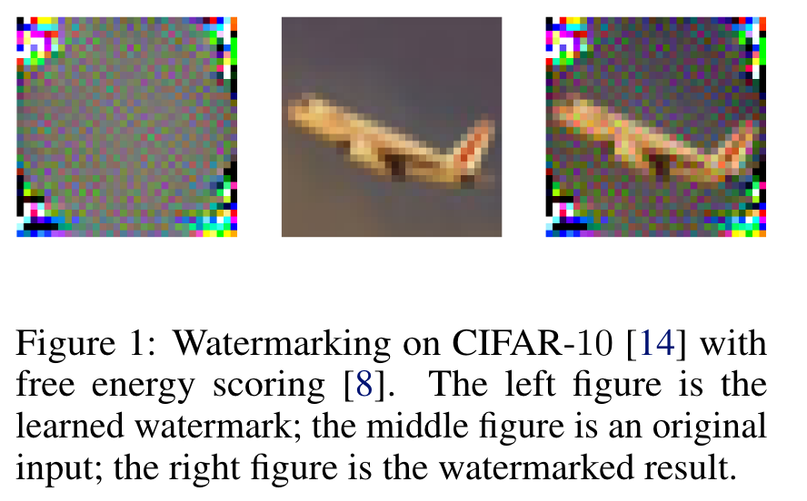
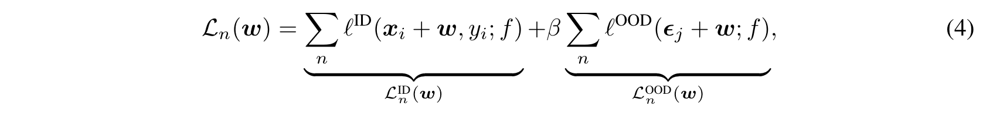

# Watermarking for Out-of-distribution Detection

## Abstract

现有的OOD Detection方法在很大程度上忽略了深层模型的**重新编程特性**，因此可能无法完全发挥其内在优势：在不修改训练有素的深层模型的参数的情况下，我们可以通过数据级操作重新编程该模型以达到新的目的（例如，**向数据添加特定的特征扰动**）。这一特性促使我们**重新编程分类模型以擅长 OOD 检测**（一项新任务），因此我们在本文中提出了一种名为水印的通用方法。具体来说，我们学习了一个**叠加到原始数据特征上的统一模式**，并且水印后模型的检测能力大大提高。大量实验验证了水印的有效性，证明了深度模型的重编程特性在 OOD 检测中的重要性。

## Introduction

- **Motivation**

  以前的工作在很大程度上**忽略了深度模型的重编程特性**：经过良好训练的模型可以**通过原始输入的适当转换（如特征扰动）来重新用于新任务**，而无需修改任何模型参数。例如，可以对在 ImageNet 数据集上预训练的模型进行重新编程，以对生物医学图像进行分类 [13]。这一特性表明了使训练有素的模型适应有效的 OOD 检测的可能性，激励我们首次**尝试研究深度模型的重编程特性是否有助于解决 OOD 检测**，即**我们是否可以对训练有素的深度模型进行重新编程OOD 检测模型**（一项新任务）？

- **Method Overview**

  

  在本文中，我们提出了一种新的方法——水印，通过在原始输入中添加水印来重新编程训练有素的模型，使模型能够很好地检测 OOD 数据。水印与原始输入**具有相同的形状**，这是可以为测试时输入添加的**静态模式**（参见图 1）。预定义的评分策略将得到增强，带水印的 ID 和 OOD 数据之间的 OOD 分数差距会扩大。

  由于事先缺乏对未见过的 OOD 数据的了解，找到正确的水印并非易事。为了解决这个问题，我们提出了一个有效**水印的学习框架**。其见解是让训练有素的模型为**带水印的 ID 输入生成高分**，同时规范水印，以便模型在不感知 ID 模式的情况下返回低置信度。在这种情况下，模型对于带水印的 ID 输入将具有相对较高的分数，而对于 OOD 数据，分数仍然较低。原因是**模型遇到了带水印的输入，但没有看到任何 ID 模式。**在我们的实现中，我们采用了几种有代表性的评分策略，设计了特定的学习目标并提出了可靠的优化算法来学习有效的水印。

  为了理解水印，图 1 描述了在 CIFAR-10 数据集上学习的水印，以及energy-scoring。正如我们所看到的，学习到的水印的**中心区域很大程度上保留了原始输入模**式，包含原始指导检测的语义消息。相比之下，原始输入的边缘区域由水印的特定图案叠加，这可以对模型隐藏的知识进行编码，以增强 OOD 检测。总体而言，水印可以在检测中保留原始输入的有意义的模式，并通过从训练模型和 ID 数据中学习到改进的检测能力。

  水印的成功源于以下几个方面：

  1. 训练有素的分类模型有可能被重新编程用于 OOD 检测，因为它们是两个相关的任务；
  2. 重编程已被广泛研究，从图像分类到时间序列分析，使我们的建议在各个领域具有通用性；
  3. OOD 检测缺乏对现实世界 OOD 分布的了解。幸运的是，通过仅在低维度进行数据级操作，水印可以在很大程度上缓解有限数据的问题。

  总的来说，这种数据级操作与现有方法是正交的，从而为 OOD 检测提供了一条新的道路，并且可以启发未来设计 OOD 检测方法的更多方法。

## Watermarking Strategy

- **定义**

  水印$w\in\mathbb{R}$是一个统一的模式，其形状与原始输入完全相同。它被静态地添加到测试时输入中，我们将$w + x$称为$\forall x\in X$的水印输入。

- **学习策略**

  水印的学习目标需要同时考虑 ID 和 OOD 数据。我们通常没有关于 OOD 分布的信息，但我们仍然希望模型能够擅长从评分中辨别 ID 和 OOD 数据。对于这个挑战，如果观察到**带水印的 ID 数据，我们会让模型产生高分**；同时，我们对水印进行**正则化**，使得**当 ID 模式不存在时模型将返回低分**。从我们模型的角度来看，如果给出带水印的 OOD 输入，分数应该保持较低，因为水印没有经过训练来感知 OOD 数据，其中的模式与 ID 数据非常不同。

- **水印的优势**

  水印直接对模型进行重新编程，以适应我们指定的评分任务，从而大大提高原始模型的检测能力。相比之下，以前的方法通常仅通过阈值$ τ $来适应其指定的任务。然而，当评分密度不可分离时，需要在假阳性 (ID) 和假阴性 (OOD) 率之间进行权衡。

  此外，水印享有以前基于分类的方法的好处，因为我们不修改分类中的原始训练过程，从而水印易于部署在现实世界的系统中。虽然也应该学习水印，但参数空间是低维的，学习过程可以在系统部署后**事后进行**。

- **与现有方法比较**

  在 OOD 检测中，本文首次尝试利用深度模型的重编程特性，提出了一种有效的学习框架，即水印。乍一看，我们的方法似乎与 ODIN类似，它也对 OOD 检测进行数据级扰动。然而，它们的实例指定的扰动**依赖于测试期间额外的向后向前迭代**，这在我们的方法中是不需要的。此外，**ODIN 是为 softmax 评分而设计**的，但水印在 OOD 检测中非常通用。

## Realizations of Watermarking Strategy

- **学习目标**

  如上所述，我们需要分别考虑ID和OOD情况，相关的损失函数用$l^{ID}(·)$和$l^{OOD}(·)$表示。

  对于 ID 情况，需要 ID 训练数据，我们**为带水印的对应数据取得高分**。相比之下，由于我们通常缺乏对测试时 OOD 数据的了解，因此对于OOD**仅使用水印**，并且我们期望模型在**仅感知水印时产生尽可能低的分数**。

  此外，由于在 OOD 情况下仅采用水印进行训练，因此学习到的水印对于检测模型非常敏感，即，模型在面对小扰动时可能会返回不同的预测。因此，带水印的 OOD 输入可能无法保证低分。为此，在训练期间进一步扰动水印。这里我们采用高斯噪声，产生$\epsilon+w$ 形式的扰动水印，其中$\epsilon$ 是d维的独立同分布高斯噪声。那么，总体损失可以写为：

  

- **学习算法框架**

  首先，水印由独立同分布（i.i.d）初始化。具有 0 均值和小标准差的高斯噪声，学习过程的每个更新步骤的三个阶段组成：

  1. 负采样：对一组噪声数据进行采样，假设大小为一个ID样本mini-batch中的m个样本。
  2. 风险计算：计算ID 和OOD 数据的风险，总体风险由它们与权衡参数β 的总和给出。
  3. 水印更新：**一阶梯度引导水印的像素级更新**，使用梯度符号和SAM 进行可靠更新。

  将学习到的水印添加到 OOD 检测的测试时输入中，然后部署具有预定义评分函数的检测模型。