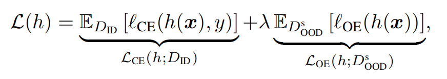
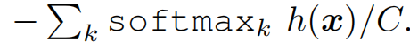
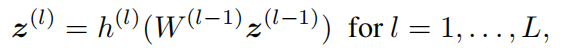
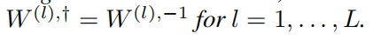
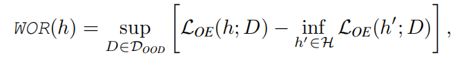
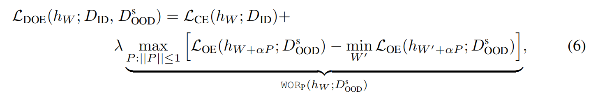
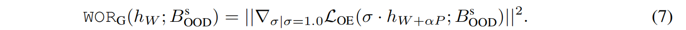
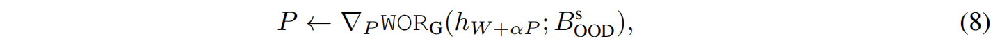
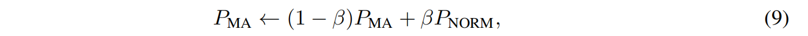
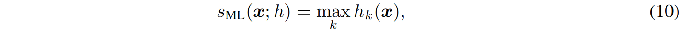

## Abstract

离群点暴露（OE）在分布外（OOD）检测中非常强大，它通过使用代理 OOD 数据对模型进行微调来提高检测能力。然而，代理数据通常偏离测试 OOD 数据。因此，在面对未见过的 OOD 数据时，OE 的性能会被削弱。

为了解决这个问题，我们提出了一种基于 OE 的新方法，该方法能使模型在不可见的 OOD 情况下表现良好。它提出了一种最小-最大学习方案--搜索并综合导致最差判断的 OOD 数据，并从这些 OOD 数据中学习，以获得统一的 OOD 检测性能。

在我们的实现过程中，这些最差的 OOD 数据是通过转换原始代理数据而合成。具体来说，相关的转换函数是基于我们对模型扰动导致数据转换的新见解而隐式学习。我们的方法提供了一种合成 OOD 数据的有效途径，除了代理 OOD 数据外，它还能使检测模型进一步受益。我们在各种 OOD 检测设置下进行了广泛的实验，证明了我们的方法与先进的同类方法相比的有效性。

## Introduction

开放世界中的深度学习系统经常会遇到分布外（OOD）数据，这些数据的标签空间与分布内（ID）样本的标签空间是不相交的。

对于许多安全关键型应用来说，深度模型应该对 ID 数据做出**可靠的预测**，而 OOD 情况则应作为**异常情况**报告。这就导致了众所周知的 OOD 检测问题，该问题在可信机器学习领域引起了广泛关注。

由于深度模型在面对 OOD 数据时可能过于自信，因此 OOD 检测仍然不是一件容易的事。在判别模型的基础上，现有的 OOD 检测方法一般可分为两类，即posthoc方法和fine-tuning方法。

1. Posthoc事后方法：假定在 ID 数据上有一个训练有素的模型及其固定参数，利用模型响应设计各种**评分函数**来表示 ID 和 OOD 情况。
2. fine-tuning微调方法：允许调整目标模型，通过正则化提高其检测能力。通常，微调方法得益于训练过程中对**未知因素**的明确了解，因此通常能在各种实际情况下显示出可靠的性能。

微调方法中，离群点暴露（OE）是最有效的方法之一，它在训练过程中使用代理 OOD 数据来辨别 ID 和 OOD 模式。通过使这些代理OOD 数据以低置信度预测，OE使检测模型能够学习有效检测 OOD 的知识。

需要注意，我们很难知道在部署模型时会遇到什么样的 OOD 数据，因而在代理（训练时间）和未见（测试时间）OOD 案例之间存在分布差距。从根本上说，这种分布差距对 OOD 检测是有害的，因为当测试时的OOD 数据与训练时OOD 数据有很大偏差时很难保证模型的性能。

对于 OE 而言，解决 **OOD 分布差距**问题至关重要也极具挑战性。与该问题相关的几项研究通常通过让模型从**额外的** OOD 数据中学习来缩小差距。如，

1. Lee 等人（2018a）合成生成模型判别出错的OOD 数据，这部分合成数据由检测模型作**低置信度预测**。然而，合成未见数据在一般情况下是难以实现的（Du 等人，2022 年），这意味着相应的数据可能无法完全有益于 OE 训练。
2. 相反，Zhang 等人（2023 年）将 ID 和代理 OOD 数据**混合**起来，以扩大 OOD 案例的覆盖范围；Du 等人（2022 年）从**低维特征空间**中类条件分布的低似然区采样 OOD 数据。然而，前者的**线性插值**难以覆盖各种 OOD 情况，而后者的特征空间数据生成可能无法使**底层特征提取器**充分受益。因此，要解决 OE 中的 OOD 分布差距问题，还有很长的路要走。

为了克服上述弊端，我们提出了一种简单而强大的方法来获取额外的 OOD 数据，将现有的代理数据转换为新的 OOD 数据，使我们的检测模型进一步受益。其关键在于，**模型扰动会隐含地导致数据转换**，而检测模型可以在扰动后通过**模型更新**从这些隐含数据中学习。相关的变换函数摆脱了繁琐的人工设计（Zhang 等人，2023；Huang 等人，2023）和复杂的生成模型（Lee 等人，2018b），同时对于偏离原始数据的合成 OOD 数据保持灵活性。在此，有两个因素支持我们的数据合成的有效性：

1. 隐含数据遵循与原始数据不同的分布
2. 考虑到我们的检测模型足够深入，原始数据和转换后的数据分布之间的差异可以非常大。这表明，我们可以有效地合成与原始数据**大不相同的**额外 OOD 数据。然后，我们可以从这些数据中学习，进一步完善检测模型。

因此，我们提出了**分布无关的离群点检测**（*Distributional-agnostic Outlier Exposure*，DOE），这是一种基于隐式数据转换的新型离群点检测方法。“分布无关”一词反映了我们的最终目标，即在训练过程中只访问 ID 和代理 OOD 数据，使检测模型在各种未见（测试阶段）的OOD 分布情况下表现一致。

在 DOE 中，我们用候选 OOD 分布集的**最差** OOD 遗憾值（*worst OOD regret*, WOR）来衡量模型在 OOD 检测中的性能，从而得出如公式 6 所示的**最小-最大学习方案**。然后，基于我们系统化的隐式数据合成方法，我们在以下两个方面进行迭代：1）通过**模型扰动**搜索导致大 WOR 的隐式 OOD 数据；2）从这些数据中学习检测模型的均匀检测能力。

DOE 与分布稳健优化（*distributionally robust optimization,* DRO）相关，后者同样是从最坏情况分布中学习。图 1 总结了它们的概念比较。其中，DRO 考虑的是封闭世界环境，力求在支持中的**各种数据分布方面表现一致**（Sagawa 等人，2020 年）。然而，在需要检测未见数据的**开放世界 OOD** 设置中（参见第 5.3 节），也就是图 1（b）中与代理数据不相交的测试支持部分，它却失效了。相比之下，我们的数据转换提供了一种从未曾见过的数据中学习的有效方法，考虑到了区域在**支持之外**的均匀性能。因此，DOE 可以在一定程度上缓解分布差距问题，图 1(c) 中的不相交区域小于 DRO 案例就反映了这一点。

性能提升：在普通 OOD 检测(common OOD detection)方面，与 CIFAR-10、CIFAR-100 和 ImageNet 数据集上的原始 OE 相比，我们的 DOE 将平均 **FPR95** 降低了 7.26%、20.30% 和 13.97%。

在困难OOD 检测(hard OOD detection)方面，与各种困难OOD 数据集上的先进方法相比，我们的 DOE 将 **FPR95** 降低了 7.45%、7.75% 和 4.09%。

## Preliminary

$D_{ID}$：$X*Y$

$D_{OOD}$: 无关分布，其label和Y没有交集，在训练阶段也不可见

### Softmax Scoring

利用maximum softmax prediction，设定了一个阈值来在测试阶段判断输入是来自$D_{ID}$还是$D_{OOD}$。

$$
s_{\mathrm{MSP}}(\boldsymbol{x} ; h)=\max _{k} \operatorname{softmax}_{k} h(\boldsymbol{x}),
$$

由于OOD的label与Y没有交集，其softmax的结果会小于来自$D_{ID}$的样本。

### Outlier Exposure

MSP可能会对某些OOD数据做出**过于自信（置信度不低反高）**的预测，不利于有效的OOD检测。

因此，OE通过学习代理OOD分布$D_{OOD}^s$来提升MSP模型h(-)的检测性能。

$l_{CE}$为交叉熵，$l_{OE}$为均匀分布的KL散度，可以写成：

$l_{OE}$使得h(-)学习代理OOD数据为低置信度。由于模型可以在训练阶段看到部分OOD数据，OE在OOD检测中的性能是可信的。

然而，代理的OOD数据$D_{OOD}^s$与真实世界的$D_{OOD}$区别相当大，这也导致了训练$D_{OOD}^s$与测试-$D_{OOD}$之间存在gap。在部署时，模型会继承这种数据偏差，可能会对与代理OOD不同的真实OOD又做出过于自信的预测（OE在真实OOD下是失效的）。

## OOD Synthesis

OOD 分布gap的问题源于我们对（测试阶段）未见 OOD 数据的了解不足。因此，一种直接的方法是通过**数据合成**让模型访问额外的 OOD 数据，尽力填补训练时和测试时的分布gap。

说到数据合成，直接的方法是利用**生成模型**（Lee 等人，2018a），而生成未见数据一般来说是难以实现的（Du 等人，2022）。因此，MixOE（Zhang 等人，2023 年）将 ID 和代理 OOD 混合起来，以扩大各种 OOD 情况的覆盖范围，而 VOS（Du 等人，2022 年）则在嵌入空间中针对**低似然 ID 区域**生成**额外的 OOD**。然而，前者依赖于人工设计的合成程序，难以覆盖各种 OOD 情况。后者在低维空间中生成 OOD，这依赖于对 ID 分布的特定假设（如高斯混合），**很难帮助底层特征提取器学习有意义的 OOD 模式**。

### Model Perturbation for Data Synthesis

考虑到以往 OOD 合成中存在的缺陷，我们提出了一种获取额外 OOD 数据的新方法。

我们将可用的**代理 OOD 数据**进行转换，合成出新的数据，使我们的模型进一步受益。相关转换函数**寄生于我们的检测模型**，无需辅助深度模型或人工设计即可学习。

其关键之处在于，**扰动模型参数与转换数据具有相同的影响**，而特定的模型扰动会产生特定的转换函数。对于我们感兴趣的有利数据（如最差的 OOD 数据），我们可以通过找到**相应的模型扰动来隐式地获取它们**。此后更新检测模型，就可以从变换后的数据（即有利数据）而不是原始输入数据中学习。

我们研究了片断仿射 ReLU 网络模型，涵盖了一大批具有 ReLU 激活、全连接层、卷积层、残差层等的深度模型。在此，我们考虑 L 层 ReLU 网络的递归定义，如下所示：

$W^{(l)}$为第l层的权重，h为RELU激活。模型的输入为$z^{(1)}=x$，输出为$z^{(L)}=h(x)$。接下来介绍乘法扰动（multiplicative perturbation）：

1. 定义1，**乘法扰动定义**：对于L层RELU网络h(-)，第l层修改为以下形式后变为乘法扰动：

   

​	$\alpha>0$为扰动强度，$A^{(l)}$为扰动矩阵。所有层都变成这种形式后，整个模型即会受到乘法扰动。接下来将第l层的乘法扰动与特征空间的数据变换联系起来。

2. 命题1，**第I层的乘法扰动等同于数据变换**：考虑数据分布D和RELU网络第l层乘法扰动。在特征空间中测量，乘法扰动等同于数据变换。此外，如果 A(l)的特征值大于 0，则变换后的数据会遵循与 D 不同的新分布 D′。因此，模型扰动为隐式修改数据及其分布提供了另一种方法。

接下来我们将命题 1 推广到整个网络的乘法扰动上，证明它可以修改原始输入空间中的数据分布

3. 理论1，**整个网络的扰动等同于整个数据分布的变换**：考虑到数据分布 D 和一个 L 层 ReLU 网络。在输入空间中测量，模型的乘法扰动等同于输入空间中遵循分布D′的数据变换。那么，如果 \(A(l)\) 的特征值大于 0 并且：

   

   那么 \(D′\) 和 D 就是不同的。上述定理的证明直接引出了下面的 Lemma，表明我们的数据合成方法可以从深度模型的分层架构中获益。

4. **网络的层数越多，变换幅度不减（不小于之前）**：考虑一个L层的RELU网络，L层的扰动矩阵$A_{L}$以及变换后的分布$D_L^{'}$

   则一定存在一个L+1层的网络，L+1层的扰动矩阵$A_{L+1}$以及变换后的分布$D_{L+1}^{'}$，$D_{L+1}^{'}$与D之间的差距不小于$D_L^{'}$和D之间的差距。

需要强调两点，1）在非负特征值的温和条件下，变换后数据的分布可能与原始数据的分布大相径庭。2）相应的变换函数具有足够复杂的层向非线性，深度模型会诱发强变换形式（关于分布）。

## Distributional-Agnostic Outlier Exposure（DOE）

我们的目标是让模型在各种测试阶段未见的OOD数据表现一致。那么，什么类型的合成OOD对模型最有利？

首先我们将模型的检测能力定义为检测最差OOD的性能。得到以下最差OOD定义（WOR）：

$D_{OOD}$为整个OOD分布，H为假设空间，sup为上限。

最小化 WOR 上限限制了 OOD 情况下检测模型的统一性能，导致 WOR 的合成 OOD 数据是我们的兴趣所在。其实我们也可以用风险来衡量检测能力，即{{ math }}$sup_{D \in \mathcal{D}_{OOD}}\mathcal{L}_{OE}(h;\mathcal{D})${{ /math }}，而我们发现基于遗憾的测量方法更好，因为它进一步**考虑了模型在面对极大的未见数据空间时的拟合能力**。

### Learning Objective

WOR衡量的是相对于最差OOD分布的最差OOD遗憾，适用于我们的基于扰动的数据转换，它可以导致新的数据分布。因此，为了从经验上确定 WOR 的上限，我们可以首先找到**导致较大 OOD 遗憾的模型扰动**，然后在其扰动后更新模型参数。这里有一个隐含的假设，即**模型（输入代理 OOD ）扰动给出的相关数据**是有效的 OOD 案例。这是合理的，因为等式 5 中的 WOR 不涉及任何使相关数据在语义或风格上接近 ID 数据的术语。

然后，我们提出了一种基于 OE 的均匀良好 OOD 检测方法，即分布无关的离群点暴露（DOE）。它由一个最小-最大学习问题形式化，即

需要注意：

1. ID在训练和测试阶段分布一致，分布gap只发生于OOD。因此WOR之应用在代理OOD上。
2. 我们采用隐含数据变换来查找最差的OOD分布，将查找空间的分布$D_{OOD}$替代为查找空间的扰动：$\{P:||P||<=1\}$。这里的阈值1可以由扰动强度$\alpha$改变。
3. 我们采用加和扰动$W+\alpha P$，这种形式比乘法容易实现，并且当假设$P=WA$时而这是等价的。

### Realization

考虑DOE的一种随机实现，即每一轮ID和OOD的mini-batch随机采样，记为$B_{ID}$和$B_{OOD}^s$。接下来强调几个关键的实现点。

**遗憾估计**: 准确的遗憾计算很困难，因为需要找到每一个候选扰动的**最优风险**。作为有效的估算，我们计算了$\mathcal{L}_{OE}$的梯度标准化：

直观上来说，梯度标准化值越大代表模型越差，因而遗憾值也应该很大。这代表了遗憾值的一个有效指标。

**扰动估计**: 采用梯度上升法来寻找合适的扰动P使得公式6达到最大值。扰动如下更新：

**稳定估计**: 公式8在一个mini-batch中计算，这个P和适用于所有训练样本的P存在偏差。为了缩小二者的差距，整个训练步骤中我们采用了$P_{NORM}$的变化平均：

$\beta$越小代表我们对越大范围的训练步数取平均，是的扰动的估计更加稳定。

**赋分函数**: 训练之后，我们采用OOD检测中的MaxLogit scoring，这种方式当面对更广的语义空间时比MSP更有效。

$h_k(-)$为logit output的第k个元素。一个较大的$s_{ML}(x;h)$表示x为ID空间的置信度越高。